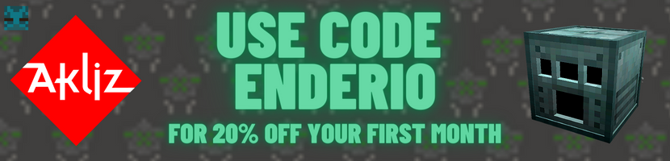

<!-- Template credit: https://github.com/othneildrew/Best-README-Template -->

<!-- PROJECT LOGO -->
<br />
<p align="center">
  <a href="https://github.com/Rover656/EnderIO-Rewrite">
    
  </a>

  <h3 align="center">EnderIO</h3>

  <p align="center">
    The full-fat tech mod for Minecraft 1.21
    <br />
    <a href="https://github.com/SleepyTrousers/EnderIO-Rewrite/wiki"><strong>Browse the Wiki »</strong></a>
    <br />
    <br />
    <a href="https://www.curseforge.com/minecraft/mc-mods/ender-io">Curseforge</a>
    ·
    <a href="https://modrinth.com/mod/enderio">Modrinth</a>
    ·
    <a href="https://discord.gg/sgYk3Jr">Discord</a>
    ·
    <a href="https://github.com/SleepyTrousers/EnderIO-Rewrite/issues/new?assignees=&labels=bug&template=bug_report.md&title=%5BBUG%5D+Short+problem+description">Report Bug</a>
    ·
    <a href="https://github.com/SleepyTrousers/EnderIO-Rewrite/issues/new?assignees=&labels=&template=feature_request.md&title=">Request Feature</a>
  </p>
</p>


<!-- TABLE OF CONTENTS -->
<details open="open">
  <summary>Table of Contents</summary>
  <ol>
    <li>
      <a href="#about-the-project">About The Project</a>
    </li>
      <li>
      <a href="#looking-for-a-server">Looking for a Server?</a>
    </li>
    <li>
      <a href="#getting-started">Getting Started</a>
      <ul>
        <li><a href="#for-players">For Players</a></li>
        <li><a href="#for-mod-developers">For Mod Developers</a></li>
      </ul>
    </li>
    <li><a href="#contributing">Contributing</a></li>
    <li><a href="#license">License</a></li>
  </ol>
</details>


<!-- ABOUT THE PROJECT -->
## About The Project

[](https://www.curseforge.com/minecraft/mc-mods/ender-io)

[](https://ci.tterrag.com/job/EnderIO-Modules/job/EnderIO-Hourly/)

Ender IO is a full-featured tech mod. It has armor, tools, weapons, machines, conduits, inventory management, mobs, etc.

Ender IO has been rewritten from the ground-up to support the latest version of Minecraft.
Some features may be missing or work differently, however we are working to re-implement everything we know and love about the original.

<!-- PARTNER BANNER -->
## Looking for a Server?

[](https://www.akliz.net/enderio)

The Ender IO Team are official Akliz partners! Akliz provides high-performance game hosting for games like Minecraft, Valheim, Satisfactory, ARK and more! Use our [coupon code](https://www.akliz.net/enderio) for 20% off your first month!

### Supported Minecraft Versions

| Minecraft Version | Ender IO Version(s) | Support Status |
|-------------------| ------------------- | -------------- |
| 1.21.1            | 7.x                 | ✅             |
| 1.20.1            | 6.x                 | ✳️             |
| < 1.20.1          | < 6.x               | ❌             |

- ❌ - Not Supported; no bug fixes or new features.
- 🚧 - Work in Progress; not ready for release.
- ✳️ - Long Term Support; receives changes through backports only.
- ✅ - In Support; the active version, receiving all bugfixes and features directly.

<!-- GETTING STARTED -->
## Getting Started

### For Players

Download the latest JAR file from GitHub releases or from [CurseForge](https://www.curseforge.com/minecraft/mc-mods/ender-io) and drop it into your `mods` folder.

### For Mod Developers

EnderIO is available via our maven.
Update your `build.gradle` to contain the following:

```groovy
repositories {
    maven { url 'https://maven.rover656.dev/releases' }
}

dependencies {
    // Include Ender IO API for compilation
    compileOnly fg.deobf("com.enderio:enderio-<module>:<VERSION>:api")
    
    // Use EnderIO at runtime
    runtimeOnly fg.deobf("com.enderio:enderio-<module>:<VERSION>")
}
```
If you need any feature in the api, contact us.

> **Note**
> If you are checking that EnderIO exists, currently it works to check for the mod id `enderio` however, it is possible that we will release Ender IO modularly again in the future.
> To support this, check for EnderIO using the module mod id's instead, `enderio_<module>`.

<!-- CONTRIBUTING -->
## Contributing

> **Note**
> Before selecting a task from the tracker to do, make sure to comment to say that you are working on it so other's don't do the same thing!
> If you are planning on contributing something that isn't tracked, consider either making an issue to discuss your proposal, or pushing a very early draft PR for discussion

1. Ensure you meet the [Forge prerequisites](https://docs.minecraftforge.net/en/latest/gettingstarted/#prerequisites).
1. Fork this repository under your own profile, this will mean you can push your changes to GitHub for Pull Requests later.
1. Clone down the forked repository using a git client or cli.
1. Open the project in your preferred IDE and wait for the gradle import.
1. Follow any other relevant Forge setup [for your IDE](https://docs.minecraftforge.net/en/latest/gettingstarted/#from-zero-to-modding).
1. Work on your feature or fix, try to commit for each major thing you do.
1. Create a draft pull request early for big changes to receive early feedback.


<!-- LICENSE -->
## License

All code (excluding the bundled APIs from other mods, which are covered by their respective licenses) are released without restriction into the public domain under the CC0 1.0 license (http://creativecommons.org/publicdomain/zero/1.0/legalcode) FAQ (https://wiki.creativecommons.org/CC0_FAQ).
Do what you want with it, as long as you smile while doing so. While it is not a requirement, it would be nice to know if it is being used and how, so send me hello to **crazypants.mc at gmail.com**.

Certain parts of the source code may be under a different license due to being part of other projects. Notice for the same can be found along with the said source files in the same directory. In addition to this, further licensing considerations are available to view [here](license).

### Credits
- CrazyPants
- tterrag
- HenryLoenwind
- MatthiasM
- CyanideX
- EpicSquid
- Rover656
- HypherionSA
- agnor99
- ferriarnus
- dphaldes
- and our Contributors

### Sound Credits

Below sounds are used under [CC BY 3.0](https://creativecommons.org/licenses/by/3.0/) or [CC BY-NC 3.0](https://creativecommons.org/licenses/by-nc/3.0/)

- https://freesound.org/people/Glaneur%20de%20sons/
- https://freesound.org/people/luffy/
- https://freesound.org/people/Anton/
- https://freesound.org/people/pj1s/
- https://freesound.org/people/Syna-Max/
- https://freesound.org/people/Robinhood76/
- https://freesound.org/people/zimbot/
- https://freesound.org/people/LiamG_SFX/
- https://freesound.org/people/kuchenanderung1/
- https://freesound.org/people/170048@virtualwindow.co.za/


<!-- MARKDOWN LINKS & IMAGES -->
<!-- https://www.markdownguide.org/basic-syntax/#reference-style-links -->
